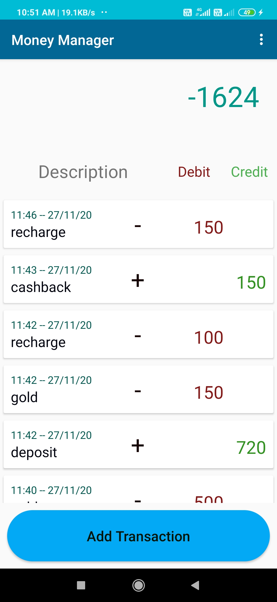
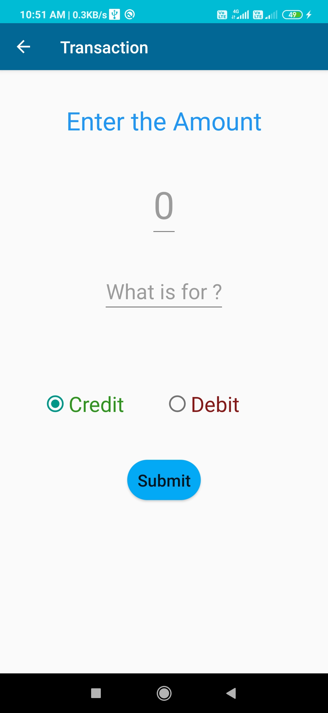

# MoneyManager

This application mainly based on MVVM architecture of android. This app maintain transaction details of a perticular person. When we touch "Add transaction" button , the app open a new activity and there we can credit or debit the amount. Based on the second activity, the total amount of first activity changes and each transaction stores in recyclerview of this app. the date and time of the transaction also stored and show iin the recyclerview. I used Room Database for this application. 

Here is some screenshots

 
